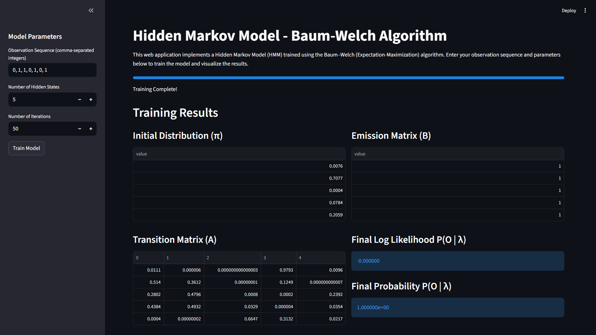
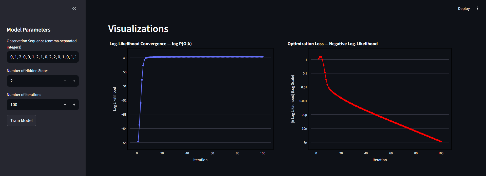
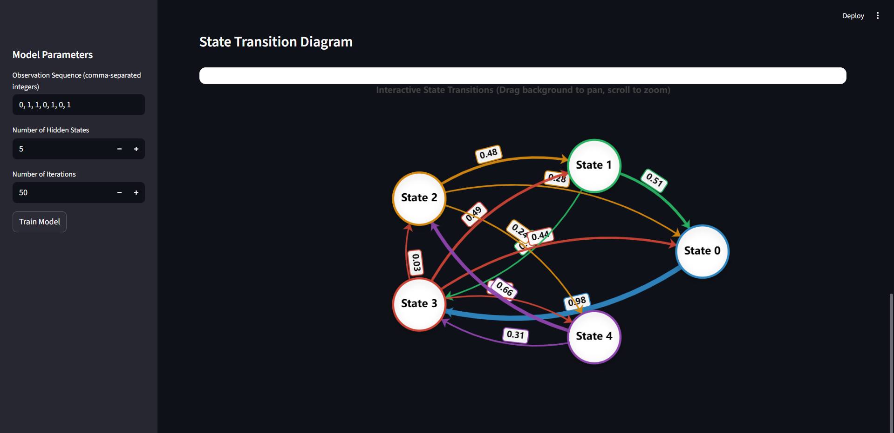

# Hidden Markov Model (HMM) - Baum-Welch Algorithm

A minimal, interactive implementation of the Baum-Welch (Expectation-Maximization) algorithm for training Hidden Markov Models. Built with Python, `hmmlearn`, `Plotly`, and `Apache ECharts` via `Streamlit`.

---

<div align="center">
  <h1><b>Surya T S</b></h1>
  <h2><b>TCR24CS069</b></h2>
</div>

---

## Gallery

### Web App Interface


### Convergence Plots


### State Transition Diagram


---

## User Manual & Quick Start

### 1. Run the Interactive Web App (Recommended)
Experience the algorithm visually with dynamic inputs, matrix rendering, and highly accurate, animated state transition diagrams.

```powershell
python -m streamlit run app.py
```

#### How to use the Web App:
1. **Input Parameters**: Enter the number of hidden states, unique observations, and max iterations in the sidebar.
2. **Observation Sequence**: Enter a comma-separated list of integers (e.g., `0, 1, 0, 2, 1`).
3. **Train Model**: Click the "Train HMM Model" button to view the learned matrices ($\pi$, $A$, $B$) and Final Log Likelihood.
4. **Analyze & Explore**: Interact with the Plotly convergence graphs and hover/drag the ECharts state transition diagram to explore probabilities.

### 2. Run the CLI Version
For a quick terminal-based execution:

```powershell
python train.py
```

---

## What it Computes
- **Initial Distribution ($\pi$)**
- **Transition Matrix ($A$)**
- **Emission Matrix ($B$)**
- **Log Likelihood $P(O | \lambda)$**
- **Convergence Graph** (Log likelihood vs Iterations)

---

## Installation & Setup

Follow these steps to download and run the project on your local machine.

### 1. Clone the Repository
First, download the project files to your computer using Git:
```powershell
git clone https://github.com/Surya-T-S/HMM-Baum-welch-visualizer.git
cd HMM-Baum-welch-visualizer
```
*(If you downloaded the project as a ZIP file, simply extract it and open the folder in your terminal).

### 2. Create a Virtual Environment (Recommended)
It is highly recommended to create a Python virtual environment to keep the project dependencies isolated from your system Python.

```powershell
# Create a virtual environment named 'venv'
python -m venv venv

# Activate the virtual environment (Windows)
.\venv\Scripts\activate

# Activate the virtual environment (Mac/Linux)
# source venv/bin/activate
```

### 3. Install Dependencies
With the virtual environment activated, install all required Python packages:
```powershell
pip install -r requirements.txt
```

---

## License

This project is licensed under the MIT License - see the [LICENSE](LICENSE) file for details.
